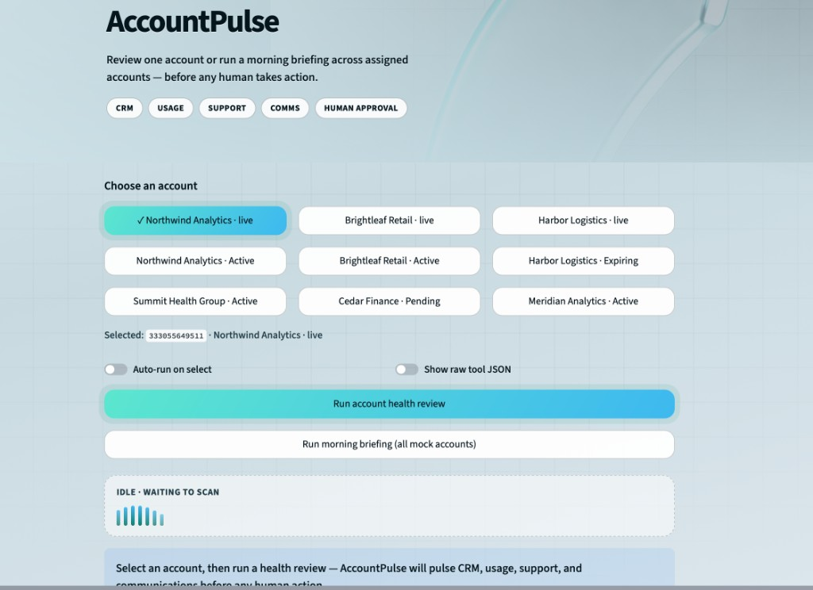

# Cycle 3 — AccountPulse

**Status:** In progress  
**Repo:** https://github.com/brovaset/AccountPulse  
**Live demo:** https://accountpulse.streamlit.app/

## Problem

CSMs experience fragmented account monitoring because renewal dates, product usage, support tickets, and customer communications live across separate systems. A CSM managing ~50 accounts can spend 2–3 hours a day just aggregating account-health signals before deciding whether action is needed — and a common missed-risk scenario is a support ticket open 7+ days on an account also inside a 60-day renewal window, where those two signals simply never get looked at side by side.

## Solution

AccountPulse is an AI agent for Customer Success Managers that identifies at-risk customer accounts before risk becomes churn. It’s a **read-only** advisor: it runs each morning or on request, pulls signals from CRM, product usage, support, and communication tools, classifies each account (Action Needed / Watch / Healthy / Needs Manual Review), explains its reasoning with sources, and recommends a next step. The CSM reviews the evidence and decides which accounts to act on — the agent informs, the human decides.

**Observe → decide → act loop:** AccountPulse observes account signals across CRM, support, usage, and comms → decides a risk classification and next-step recommendation → surfaces a prioritized briefing for the CSM to act on.

## Key features

- Four tools pulling account signals: CRM (HubSpot), product usage (PostHog), support tickets (Zendesk), communication activity (Gmail) — mock data by default, live connectors when credentials are set
- Deterministic, rules-based reporting (not just LLM output) for stable, reproducible demo results
- Morning briefing mode — prioritized report across an entire book of accounts
- Human-approval-required guardrail before any customer-facing or account-changing action
- Treats CRM notes/ticket text as untrusted input — explicitly resists prompt injection from within that data
- Streamlit UI for picking an account and running a review or a full briefing

## Tech stack

Python, Streamlit, pytest, uv (dependency/env management); mock + live integrations with HubSpot, PostHog, Zendesk, Gmail

## Screenshot / live link

Live demo: https://accountpulse.streamlit.app/

AccountPulse UI — account selection and health review. Choosing an account and running an on-demand health review or a morning briefing across the assigned book.

## Built with

A two-person team — one owning CRM/HubSpot integration, Streamlit UI, and fixtures; the other owning the system prompt, agent setup, support/usage/comms tools, and evals.

## Notes

One of our mock accounts is a deliberate prompt-injection test — that forced us to design for untrusted CRM/ticket text early instead of bolting it on later.
