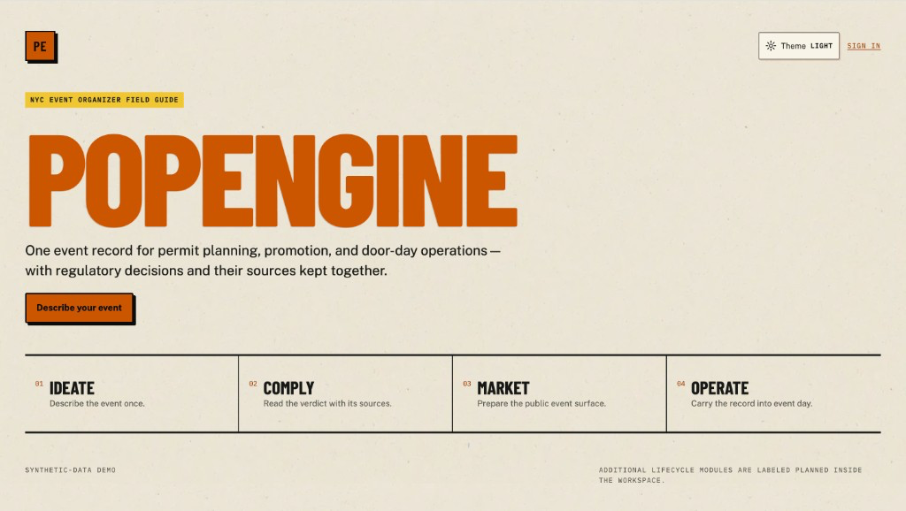

# Cycle 4 — PopEngine

**Status:** In progress  
**Repo:** https://github.com/jzeng151/pop-engine

## Problem

Independent NYC event organizers have to navigate a permit maze spread across at least seven different agencies (SAPO, Parks, NYPD, DOT, FDNY, DOB, Health), each with its own portal, lead time, and fee structure. A single event that touches a sidewalk, serves food, and plays music can trigger four separate permits with lead times ranging from 5 days to over a year out, and nothing tells the organizer up front which permits apply or whether their date is even feasible. Right now the only real alternatives are hiring a production agency (priced for brand activations, not independents) or piecing it together from static blog guides that can’t evaluate a specific event.

## Solution

PopEngine takes a short questionnaire about the event (borough, location type, headcount, date, food, sound, structures, flame, alcohol, power) and generates a complete, source-cited permit plan: every required permit and agency, official lead times and fees, required documents, and a backward-computed timeline with an immediate feasibility verdict (Feasible / Feasible-at-risk / Conditional / Infeasible). The plan becomes a live checklist with deadline alerts and direct links to the right city portals through event day.

The architecture isolates the rules engine as a pure logic layer (no DB/HTTP/clock), with thin apps on top, so the rules stay testable and independent of any framework.

## Features complete so far (MVP core)

- Event intake questionnaire with conditional branching — a typical event takes 10–15 questions, under 2 minutes
- Permit plan generator evaluating a 33-rule, 4-advisory NYC ruleset, with every line item citing its official source and verification status (confirmed / conflicting / research-required)
- Feasibility verdict engine — computes deadlines backward from the event date and flags infeasible timelines with the specific blocking requirement (e.g. a missed 45-day SAPO filing window)
- Rules snapshot banner showing exactly which ruleset version and publish date produced the plan
- Live compliance checklist with per-permit status tracking and document upload
- Deadline alerts (email live; SMS simulated in-product as a fallback until Twilio registration clears)
- Portal deep links with prepared document packages for each required permit

## Still in progress

App-less QR check-in and a live ops dashboard for event day (Phase 1.5 stretch goals), plus a longer roadmap covering saved/resumable intake, full application tracking, calendar export, AI-assisted free-text intake, and eventually rules support for cities beyond NYC.

## Tech stack

React / Next.js (frontend), Node.js / Express (backend), PostgreSQL (including a dedicated rules table), Twilio for SMS deadline alerts. Rules are stored as versioned data (conditions → findings) rather than hardcoded logic, so updates to NYC permit requirements are data changes, not code changes.

## Screenshot / live link

*[placeholder — add a screenshot of the organizer UI or the gated demo link]*

Drop a screenshot into this folder as `screenshot.png` and reference it here when ready:

```md

```

## Built with

A four-person team — Naquan McKune, Jason Zeng, Adedoyin Ahoton, and Bo Moldenhauer.

## Notes

Keeping the rules engine pure (no DB/HTTP/clock) made testing easy but meant extra plumbing to wire real dates and data back in at the API layer. Isolating that package is the engineering choice that keeps permit logic unit-testable without standing up the full stack.
